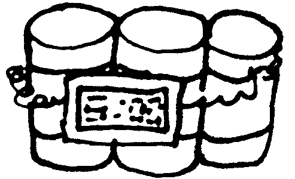

# Ephemeral DB

I like to use mongo, but don't like leaving connections lying open. I don't know if that's crazy. And frankly, I don't care. This is why I made this maddening module to self-close the connection.

I built this thing on Debian but couldn't get it to connect. I didn't believe it couldn't connect though so I finished testing on Windows. So we'll see what's up later. Because lo and behold, it worked on Windows.

## Install
`npm i @dillonchr/ephemeraldb`

## Usage
You have to first set up your `ENV` variables.

* **DB_URI** - your `mongodb://` connection string
* **DB_NAME** - the db name you're planning to use
* **DB_DISCONNECT_TIMEOUT** - how long before we kill the connection in millis

## Methods
Man, do I have to list them all? Can't I just publish the thing first then go back and add detailed documentation?

Well, if you don't want anyone to use your module you can.

`leaves, publishes package as-is`

Sigh....
